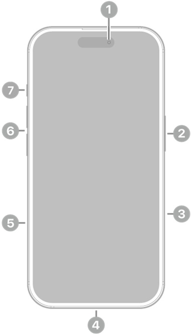
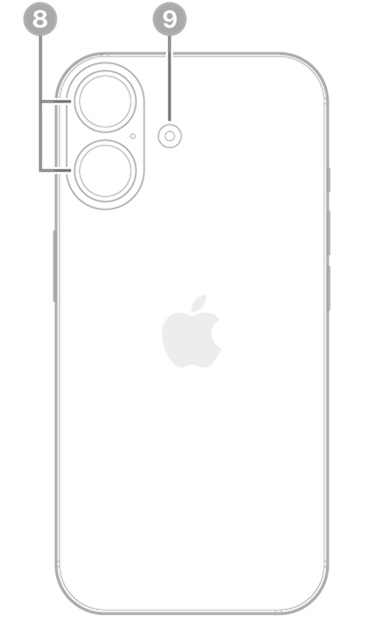

# iPhone 16 - Especificaciones técnicas

**Año de presentación:** 2024

## Acabado
- Negro
- Blanco
- Rosa
- Verde azulado
- Azul ultramar

**Diseño:** Aluminio, Parte delantera con Ceramic Shield de última generación, Parte trasera de vidrio tintado en masa (negro, rosa, verde azulado y azul ultramar)

## Capacidad
- 128 GB
- 256 GB
- 512 GB

## Dimensiones y peso
- **Ancho:** 7,16 cm
- **Alto:** 14,76 cm
- **Grosor:** 0,78 cm
- **Peso:** 170 g

## Pantalla
- Pantalla Super Retina XDR
- Pantalla OLED de 6,1 pulgadas (15,54 cm) en diagonal
- Resolución de 2.556 por 1.179 píxeles a 460 p/p
- Dynamic Island
- Pantalla HDR
- True Tone
- Gama cromática amplia (P3)
- Respuesta háptica
- Contraste de 2.000.000:1 (típico)
- Brillo máximo de 1.000 nits (típico), pico de brillo de 1.600 nits (HDR), pico de brillo de 2000 nits (en exteriores) y brillo mínimo de 1 nit
- Cubierta oleófuga antihuellas
- Compatible con la presentación simultánea de múltiples idiomas y grupos de caracteres

La pantalla del iPhone 16 tiene esquinas redondeadas que rematan el diseño curvo del dispositivo, y esas esquinas se encuentran dentro de un rectángulo estándar. Si se mide como un rectángulo estándar en diagonal, la pantalla tiene 6,12 pulgadas. La superficie real de visión es inferior.

## Resistencia a las salpicaduras, el agua y el polvo
**Calificación IP68** según la norma IEC 60529 (hasta 6 metros de profundidad durante un máximo de 30 minutos)

## Chip
- **Chip A18**
- Nueva CPU de 6 núcleos (2 de rendimiento y 4 de eficiencia)
- Nueva GPU de 5 núcleos
- Nuevo Neural Engine de 16 núcleos

## Cámara
**Sistema avanzado de cámara dual**
- **Cámara Fusion de 48 Mpx:** 26 mm, apertura de ƒ/1,6, estabilización óptica de imagen por desplazamiento del sensor, 100 % Focus Pixels y compatibilidad con fotos de superalta resolución (24 y 48 Mpx)
- **Teleobjetivo x2 de 12 Mpx:** 48 mm, apertura de ƒ/1,78, estabilización óptica de imagen por desplazamiento del sensor de segunda generación y 100 % Focus Pixels
- **Ultra gran angular de 12 Mpx:** 13 mm, apertura de ƒ/2,2 y campo de visión de 120° y 100 % Focus Pixels
- Zoom óptico de acercamiento x2, zoom óptico de alejamiento x2 y rango de zoom óptico x4
- Zoom digital hasta x10
- Control de Cámara
- Cubierta de la lente de cristal de zafiro
- Flash True Tone
- Photonic Engine
- Deep Fusion
- HDR Inteligente 5
- Retratos de última generación con Control de Profundidad y Enfoque
- Iluminación de Retratos con seis efectos
- Modo Noche
- Fotos panorámicas (hasta 63 Mpx)
- Estilos Fotográficos de última generación
- Fotos espaciales
- Fotografía macro
- Gama cromática amplia para fotos y Live Photos
- Corrección del objetivo (ultra gran angular)
- Corrección avanzada de ojos rojos
- Estabilización automática de imagen
- Modo ráfaga
- Geoetiquetado de fotos
- Captura de imagen en formato HEIF y JPEG

### Grabación de vídeo
- Grabación de vídeo en 4K a 24, 25, 30 o 60 f/s con Dolby Vision
- Grabación de vídeo en 1080p a 25, 30 o 60 f/s con Dolby Vision
- Grabación de vídeo en 720p a 30 f/s con Dolby Vision
- Modo Cine hasta 4K HDR a 30 f/s
- Modo Acción hasta 2,8K a 60 f/s
- Grabación de vídeo macro, a cámara lenta y en time lapse
- Vídeo a cámara lenta en 1080p a 120 o 240 f/s
- Grabación de vídeo espacial en 1080p a 30 f/s
- Vídeo en time lapse con estabilización
- Time-lapse con modo Noche
- Vídeo QuickTake hasta 4K a 60 f/s con Dolby Vision
- Estabilización óptica de imagen por desplazamiento del sensor para vídeo (cámara Fusion)
- Zoom digital hasta x6
- Zoom de audio
- Flash True Tone
- Estabilización de vídeo con calidad de cine (4K, 1080p y 720p)
- Enfoque automático continuo
- Opción de sacar fotos de 8 Mpx durante la grabación de vídeo en 4K
- Reproducción con zoom
- Grabación de vídeo en formato HEVC y H.264
- Audio espacial y grabación en estéreo
- Reducción de ruido del viento
- Mezcla de Audio

### Cámara TrueDepth
- **Cámara de 12 Mpx**
- Apertura de ƒ/1,9
- Enfoque automático con Focus Pixels
- Retina Flash
- Photonic Engine
- Deep Fusion
- HDR Inteligente 5
- Retratos de última generación con Control de Profundidad y Enfoque
- Iluminación de Retratos con seis efectos
- Animoji y Memoji
- Modo Noche
- Estilos Fotográficos de última generación
- Gama cromática amplia para fotos y Live Photos
- Corrección del objetivo
- Estabilización automática de imagen
- Modo ráfaga
- Grabación de vídeo en 4K a 24, 25, 30 o 60 f/s con Dolby Vision
- Grabación de vídeo en 1080p a 25, 30 o 60 f/s con Dolby Vision
- Modo Cine hasta 4K a 30 f/s con Dolby Vision
- Vídeo a cámara lenta en 1080p a 120 f/s
- Vídeo en time lapse con estabilización
- Time-lapse con modo Noche
- Vídeo QuickTake hasta 4K a 60 f/s con Dolby Vision
- Estabilización de vídeo con calidad de cine (4K, 1080p y 720p)
- Audio espacial y grabación en estéreo

## Face ID
Reconocimiento facial mediante la cámara TrueDepth

## Apple Pay
- Usa Face ID para pagar en tiendas, apps y páginas web con tu iPhone
- Confirma las compras realizadas con Apple Pay en el Mac

## Seguridad
- Emergencia SOS vía satélite
- Detección de accidentes

## Redes móviles e inalámbricas
**Modelo A3287** | **Modelo A3290**
- FDD-5G NR (bandas n1, n2, n3, n5, n7, n8, n12, n20, n25, n26, n28, n30, n66, n70, n75 y n76)
- TDD-5G NR (bandas n38, n40, n41, n48, n53, n77, n78 y n79)
- FDD-LTE (bandas 1, 2, 3, 4, 5, 7, 8, 12, 13, 17, 18, 19, 20, 25, 26, 28, 30, 32 y 66)
- TDD-LTE (bandas 34, 38, 39, 40, 41, 42, 48 y 53)
- UMTS/HSPA+/DC HSDPA (850, 900, 1.700/2.100, 1.900 y 2.100 MHz)
- GSM/EDGE (850, 900, 1.800 y 1.900 MHz)

**Todos los modelos**
- 5G (sub 6 GHz) con MIMO 4x4
- LTE Gigabit con MIMO 4x4 y LAA
- Wi-Fi 7 con MIMO 2x2
- Bluetooth 5.3
- Chip de banda ultraancha de segunda generación
- Tecnología de red Thread
- NFC con modo de lectura
- Tarjetas exprés con reserva de batería

Para obtener más información sobre la compatibilidad con redes 5G y LTE, ponte en contacto con tu operador y consulta la página [apple.com/es/iphone/cellular](https://www.apple.com/es/iphone/cellular).

## Geolocalización
- GPS, GLONASS, Galileo, QZSS y BeiDou
- Brújula digital
- Wifi
- Redes móviles
- Microlocalización iBeacon

## Videollamadas
- Videollamadas FaceTime vía wifi o red móvil
- Videollamadas FaceTime HD (1080p) vía wifi o redes 5G
- SharePlay en llamadas FaceTime para disfrutar de películas, series, música y apps en compañía
- Pantalla compartida
- Modo Retrato en videollamadas FaceTime
- Audio espacial
- Modos de micrófono Aislamiento de Voz y Sonido de Fondo
- Zoom en la cámara trasera

## Llamadas de voz
- Llamadas de voz FaceTime
- Voz por LTE (VoLTE)
- Llamadas vía wifi
- SharePlay en llamadas FaceTime para disfrutar de películas, series, música y apps en compañía
- Pantalla compartida
- Audio espacial
- Modos de micrófono Aislamiento de Voz y Sonido de Fondo

## Reproducción de audio
- **Formatos compatibles:** AAC, APAC, MP3, Apple Lossless, FLAC, Dolby Digital, Dolby Digital Plus y Dolby Atmos (entre otros)
- Audio espacial
- Límite de volumen configurable por el usuario

## Reproducción de vídeo
- **Formatos compatibles:** HEVC, H.264 y AV1 (entre otros)
- HDR con Dolby Vision, HDR10+/HDR10 y HLG
- AirPlay hasta 4K HDR para duplicación de pantalla y salida de fotos y vídeo a través del Apple TV (2.ª generación o posterior) o de un televisor inteligente con AirPlay
- Compatibilidad con vídeo en espejo y salida de vídeo: hasta 4K HDR a través de la salida nativa DisplayPort mediante USB-C o del adaptador de USB-C a AV digital (modelo A2119; el adaptador se vende por separado)

## Siri
- Agiliza las cosas que más haces, como mandar mensajes, poner recordatorios y mucho más
- Actívalo con solo decir «Oye Siri» o simplemente «Siri»
- Con la mayor privacidad hasta la fecha para un asistente inteligente

## Botones y conectores externos
1. Cámara delantera
2. Botón lateral
3. Control de la cámara
4. Conector USB-C
5. Bandeja de la tarjeta SIM (disponible en modelos comprados fuera de Estados Unidos)
6. Botones de volumen
7. Botón Acción
8. Cámaras traseras
9. Flash

### Prestaciones del botón Acción
- Modo Silencio, Modos de Concentración, Cámara, Linterna, Notas de Voz, Reconocer Música, Traducir, Lupa, Controles, Atajos o Accesibilidad

### Prestaciones de Control de Cámara
- Exposición, Profundidad, Zoom, Cámaras, Estilos y Tono

## Carga y ampliación
- **Conector USB-C compatible con:**
  - Carga
  - DisplayPort
  - USB 2 (hasta 480 Mb/s)

## Batería y alimentación
- **Reproducción de vídeo:** Hasta 22 horas
- **Streaming de vídeo:** Hasta 18 horas
- **Reproducción de audio:** Hasta 80 horas
- Batería recargable integrada de iones de litio
- Carga inalámbrica con MagSafe de hasta 25 W con adaptador de 30 W o superior
- Carga inalámbrica con cargadores Qi de hasta 7,5 W
- Carga rápida: Hasta un 50 % en unos 30 minutos con un adaptador de 20 W o superior y cable de carga USB-C o con un adaptador de 30 W o superior y cargador MagSafe (todos se venden por separado)

## MagSafe
- Carga inalámbrica de hasta 25 W con un adaptador de 30 W o superior
- Conjunto de imanes
- Imán de alineación
- Identificación de accesorios con NFC
- Magnetómetro

## Sensores
- Face ID
- Barómetro
- Giroscopio de alto rango dinámico
- Acelerómetro de fuerza g alta
- Sensor de proximidad
- Doble sensor de luz ambiental

## Sistema operativo
**iOS**  
iOS es el sistema operativo móvil más personal y seguro del mundo. Está repleto de funciones avanzadas y se ha diseñado para proteger tu privacidad.

## Accesibilidad
Las prestaciones integradas para distintas necesidades visuales, motrices, auditivas, cognitivas y del habla te ayudan a sacar todo el partido a tu iPhone de la forma que mejor se adapte a ti.

**Prestaciones incluidas:**
- VoiceOver
- Zoom
- Lupa
- Control por Voz
- Control por Botón
- AssistiveTouch
- Seguimiento Ocular
- Compatibilidad con RTT y TTY
- Subtítulos Opcionales
- Voz Personal
- Subtítulos en Vivo
- Voz en Tiempo Real
- Escribir a Siri
- Atajos de Voz
- Contenido Leído

## Apps integradas
- Apple Store
- App Store
- Libros
- Calculadora
- Calendario
- Cámara
- Clips
- Reloj
- Brújula
- Contactos
- FaceTime
- Archivos
- Buscar
- Fitness
- Freeform
- GarageBand
- Salud
- Casa
- iMovie
- iTunes Store
- Keynote
- Lupa
- Mail
- Mapas
- Medidas
- Mensajes
- Música
- Notas
- Numbers
- Pages
- Contraseñas
- Teléfono
- Fotos
- Podcasts
- Recordatorios
- Safari
- Ajustes
- Atajos
- Bolsa
- Consejos
- Traducir
- TV
- Notas de Voz
- Cartera
- Watch
- Tiempo

Puedes ver la lista completa de apps de Apple disponibles en el iPhone en [apple.com/es/apps](https://www.apple.com/es/apps).

## Tarjeta SIM
- Doble SIM (Nano SIM y eSIM)
- Compatible con doble eSIM

## Clasificación de compatibilidad con audífonos
Compatible con la prestación Audífono

## Compatibilidad con adjuntos de Mail
**Tipos de documento visibles:**
- .jpg, .tiff y .gif (imágenes)
- .doc y .docx (Microsoft Word)
- .htm y .html (páginas web)
- .key (Keynote)
- .numbers (Numbers)
- .pages (Pages)
- .pdf (Vista Previa y Adobe Acrobat)
- .ppt y .pptx (Microsoft PowerPoint)
- .txt (texto)
- .rtf (formato de texto enriquecido)
- .vcf (información de contacto)
- .xls y .xlsx (Microsoft Excel)
- .zip
- .ics y .usdz (USDZ Universal)

## Requisitos del sistema
- **Cuenta de Apple** (para algunas prestaciones)
- **Acceso a internet**
- La sincronización con un Mac o PC requiere:
  - macOS Catalina 10.15 o posterior con el Finder
  - De macOS High Sierra 10.13 a macOS Mojave 10.14.6 con iTunes 12.8 o posterior
  - Windows 10 o posterior con iTunes 12.12.10 o posterior (descarga gratuita desde [apple.com/es/itunes/download](https://www.apple.com/es/itunes/download))

## Requisitos ambientales
- **Temperatura de funcionamiento:** de 0 a 35 °C
- **Temperatura de almacenamiento:** de -20 a 45 °C
- **Humedad relativa:** del 5 al 95 % sin condensación
- **Altitud máxima de funcionamiento:** probado hasta 3.000 m

## Idiomas
**Idiomas compatibles:**
Alemán, árabe, búlgaro, catalán, checo, chino (simplificado, tradicional y de Hong Kong), coreano, croata, danés, eslovaco, español (de España y Latinoamérica), finés, francés (de Canadá y Francia), griego, hebreo, hindi, húngaro, indonesio, inglés (de Australia, Estados Unidos y Reino Unido), italiano, japonés, kazajo, malayo, neerlandés, noruego, polaco, portugués (de Brasil y Portugal), rumano, ruso, sueco, tailandés, turco, ucraniano y vietnamita

**Idiomas compatibles con el teclado QuickType:**
Ainu, akan, albanés, alemán (de Alemania, Austria y Suiza), amárico, apache (occidental), árabe, árabe (najdí), armenio, asamés, asirio, azerí, bengalí (alfabético, InScript y transliteración), bielorruso, birmano, bodo, búlgaro, butanés, cabilio, cachemir (árabe y devanagari), canarés (InScript, QWERTY y transliteración), cantonés tradicional (cangjie, fonético, manual, sucheng y wubihua), catalán, checo, cheroqui, chickasaw, chino simplificado (manual, pinyin de 10 teclas, pinyin QWERTY, shuangpin y wubihua), chino tradicional (cangjie, manual, pinyin de 10 teclas, pinyin QWERTY, shuangpin, sucheng, wubihua y zhuyin), choctaw, chuvasio, cingalés, coreano (estándar y de 10 teclas), croata, danés, divehi, dogri, emoji, eslovaco, esloveno, español (de España, Latinoamérica y México), estonio, feroés, filipino, finés, flamenco, francés (de Bélgica, Canadá, Francia y Suiza), fula (adlam), gaélico irlandés, galés, georgiano, griego, gujarati (alfabético, InScript y transliteración), hausa, hawaiano, hebreo, hindi (alfabético, InScript y transliteración), hmong (pahawh), húngaro, igbo, italiano, indonesio, inglés (de Australia, Canadá, EE. UU., India, Japón, Nueva Zelanda, Reino Unido, Singapur y Sudáfrica), ingusetio, islandés, japonés (kana y romaji), jemer, kazajo, kirguís, konkaní (devanagari), kurdo (árabe, latino), laosiano, letón, lituano, lushootseed, macedonio, maithili, malayalam (alfabético, InScript y transliteración), malayo (árabe, latino), maltés, mandeo, manipurí (bengalí y alfabeto meetei), maorí, maratí (InScript, QWERTY y transliteración), maskoki, micmac, mongol, n'Ko, navajo, neerlandés, nepalí, noruego (bokmål, nynorsk), oriya (alfabético e InScript), osage, pastún, persa, persa (de Afganistán), polaco, portugués (de Brasil y Portugal), punyabí (alfabético, InScript, QWERTY y transliteración), rejang, rohinyá, rumano, ruso, sami inari, sami kildin, sami lule, sami meridional, sami pite, sami septentrional, sami skolt, sami ume, samoano, sánscrito, santali (devanagari y alfabeto Ol Chiki), serbio (cirílico y latino), sindi (árabe y devanagari), suajili, sueco, tailandés, tamazight (marroquí estándar), tamil (anjal, tamil 99 y transliteración), tayico, telugu (alfabético, InScript, QWERTY y transliteración), tibetano, tongano, turco, turcomano, ucraniano, uigur, urdú (alfabético, QWERTY y transliteración), uzbeko (árabe, cirílico y latino), vietnamita (télex, VIQR y VNI), wancho, wolastoqey, yi de Liangshan, yidis y yoruba

**Idiomas compatibles con el teclado QuickType y el autocorrector:**
Alemán (de Alemania, Austria y Suiza), árabe, árabe (najdí), bengalí (alfabético, InScript y transliteración), búlgaro, catalán, checo, cheroqui, chino simplificado (Pinyin QWERTY), chino tradicional (estándar y zhuyin), chino tradicional (Pinyin QWERTY), coreano (estándar y de 10 teclas), croata, danés, eslovaco, esloveno, español (de España, Latinoamérica y México), estonio, filipino, finés, francés (de Bélgica, Canadá, Francia y Suiza), gaélico irlandés, griego, gujarati (alfabético, InScript y transliteración), hawaiano, hebreo, hindi (alfabético, InScript y transliteración), húngaro, indonesio, inglés (de Australia, Canadá, EE. UU., India, Japón, Nueva Zelanda, Reino Unido, Singapur y Sudáfrica), islandés, italiano, japonés (kana y romaji), letonio, lituano, macedonio, malayo, maratí, (alfabético, InScript y transliteración), neerlandés (de Bélgica), neerlandés, noruego (bokmål y nynorsk), persa, persa (de Afganistán), polaco, portugués (de Brasil y Portugal), punyabí (alfabético, InScript, QWERTY y transliteración), rumano, ruso, serbio (cirílico y latino), sueco, tailandés, tamil (alfabético, anjal, tamil 99 y transliteración), telugu, turco y vietnamita.

**Idiomas compatibles con el teclado QuickType y la escritura predictiva:**
Alemán (de Alemania, Austria y Suiza), árabe, árabe (najdí), bengalí, cantonés (tradicional), checo, chino (simplificado y tradicional), coreano, danés, esloveno, español (de España, Latinoamérica y México), francés (de Bélgica, Canadá, Francia y Suiza), griego, gujarati, hebreo, hindi, indonesio, inglés (de Arabia Saudí, Australia, Canadá, Emiratos Árabes Unidos, Estados Unidos, Filipinas, India, Irlanda, Malasia, Nueva Zelanda, Reino Unido, Singapur y Sudáfrica), italiano (de Italia y Suiza), japonés, malayo, neerlandés (de Bélgica y Países Bajos), noruego (bokmål), polaco, portugués (de Brasil y Portugal), rumano, ruso, sueco, tailandés, tamil, telugu, turco y vietnamita.

**Idiomas compatibles con el teclado QuickType y QuickPath:**
Alemán (de Alemania, Austria y Suiza), árabe, chino simplificado (pinyin QWERTY), chino tradicional (pinyin QWERTY), coreano, español (de España, Latinoamérica y México), francés (de Canadá, Francia y Suiza), inglés (de Australia, Canadá, Estados Unidos, India, Japón, Nueva Zelanda, Reino Unido, Singapur y Sudáfrica), italiano, hebreo, neerlandés (de Bélgica y Países Bajos), polaco, portugués (de Brasil y Portugal), rumano, sueco y vietnamita.

**Idiomas de Siri:**
Alemán (de Alemania, Austria y Suiza), árabe (de Arabia Saudí y Emiratos Árabes Unidos), coreano (de Corea del Sur), cantonés (de China continental y Hong Kong), chino mandarín (de China continental y Taiwán), danés (de Dinamarca), español (de Chile, España, Estados Unidos y México), finés (de Finlandia), francés (de Bélgica, Canadá, Francia y Suiza), hebreo (de Israel), inglés (de Australia, Canadá, Estados Unidos, India, Irlanda, Nueva Zelanda, Reino Unido, Singapur y Sudáfrica), italiano (de Italia y Suiza), japonés (de Japón), malayo (de Malasia), neerlandés (de Bélgica y Países Bajos), noruego (de Noruega), portugués (de Brasil), ruso (de Rusia), sueco (de Suecia), tailandés (de Tailandia) y turco (de Turquía).

**Idiomas de Dictado:**
Alemán (de Alemania, Austria y Suiza), árabe (de Arabia Saudí, Catar, Emiratos Árabes Unidos, Kuwait), cantonés (de China continental y Hong Kong), catalán, checo, chino mandarín (de China continental y Taiwán), coreano, croata, danés, eslovaco, español (de Chile, Colombia, España, Estados Unidos y México), francés (de Bélgica, Canadá, Francia, Luxemburgo y Suiza), finés, griego, hebreo, hindi, húngaro, indonesio, inglés (de Arabia Saudí, Australia, Canadá, Emiratos Árabes Unidos, Estados Unidos, Filipinas, India, Irlanda, Malasia, Nueva Zelanda, Reino Unido, Singapur y Sudáfrica), italiano (de Italia y Suiza), japonés, malayo, neerlandés (de Bélgica y Países Bajos), noruego (bokmål), polaco, portugués (de Brasil y Portugal), rumano, ruso, shanghainés (de China continental), sueco, tailandés, turco, ucraniano y vietnamita.

**Idiomas con diccionario monolingüe:**
Alemán, búlgaro, catalán, chino (simplificado, tradicional y tradicional de Hong Kong), coreano, danés, español, francés, griego, hebreo, hindi, inglés (de Estados Unidos y Reino Unido), italiano, japonés, malayo, neerlandés, noruego, polaco, portugués, punyabí, rumano, ruso, sueco, tailandés y turco.

**Idiomas con diccionario de frases hechas:**
De chino simplificado y tradicional a inglés y de cantonés a inglés.

**Idiomas con diccionario bilingüe:**
De alemán a inglés, de árabe a inglés, de bengalí a inglés, de canarés a inglés, de cantonés (tradicional) a inglés, de checo a inglés, de chino (simplificado) a inglés, de chino (simplificado) a japonés, de coreano a inglés, de croata a inglés, de danés a inglés, de eslovaco a inglés, de español a inglés, de finés a inglés, de francés a alemán, de francés a inglés, de griego a inglés, de gujarati a inglés, de hindi a inglés, de húngaro a inglés, de indonesio a inglés, de Italiano a inglés, de japonés a inglés, de kazajo a inglés, de malayalam a inglés, de malayo a inglés, de neerlandés a inglés, de noruego a inglés, de polaco a inglés, de portugués a inglés, de punyabí a inglés, de ruso a inglés, de sueco a inglés, de tailandés a inglés, de tamil a inglés, de telugu a inglés, de turco a inglés, de ucraniano a inglés, de urdu a inglés, de vietnamita a inglés.

**Idiomas con diccionario de sinónimos:**
Chino simplificado e inglés (de Estados Unidos y Reino Unido).

**Revisión ortográfica:**
Alemán (de Alemania, Austria y Suiza), árabe, árabe (najdí), búlgaro, checo, danés, español (de España, Latinoamérica y México), finés, francés (de Bélgica, Canadá, Francia y Suiza), gaélico irlandés, griego, hindi (devanagari), húngaro, inglés (de Australia, Canadá, Estados Unidos, India, Japón, Nueva Zelanda, Reino Unido, Singapur y Sudáfrica), italiano, neerlandés (de Bélgica y Países Bajos), noruego (bokmål y nynorsk), polaco, portugués (de Brasil y Portugal), punyabí, rumano, ruso, sueco, telugu, turco y vietnamita.

## Zonas geográficas compatibles con Apple Pay
Alemania, Arabia Saudí, Argentina, Armenia, Australia, Austria, Azerbaiyán, Baréin, Bielorrusia, Bélgica, Brasil, Bulgaria, Canadá, Catar, Chile, China continental, Chipre, Ciudad del Vaticano, Colombia, Corea del Sur, Costa Rica, Croacia, Dinamarca, El Salvador, Emiratos Árabes Unidos, Eslovaquia, Eslovenia, España, Estados Unidos, Estonia, Finlandia, Francia, Georgia, Grecia, Groenlandia, Guatemala, Guernsey, Honduras, Hong Kong, Hungría, Irlanda, Isla de Man, Islandia, Islas Feroe, Israel, Italia, Japón, Jersey, Jordania, Kazajistán, Kuwait, Letonia, Liechtenstein, Lituania, Luxemburgo, Macao, Malasia, Malta, Marruecos, México, Moldavia, Mónaco, Montenegro, Noruega, Nueva Zelanda, Panamá, Países Bajos, Palestina, Perú, Polonia, Portugal, Reino Unido, República Checa, Rumanía, San Marino, Serbia, Singapur, Sudáfrica, Suecia, Suiza, Taiwán, Ucrania y Vietnam.

## Contenido de la caja
- iPhone 16
- Cable de carga USB-C (1 m)
- Documentación

En nuestro esfuerzo por ser neutros en carbono para 2030, el iPhone 16 y iPhone 16 Plus no incluyen adaptador de corriente ni EarPods. La caja contiene un cable USB-C de carga rápida que es compatible con adaptadores USB-C y puertos de ordenador.

Puedes usar cualquier adaptador de corriente USB-C compatible que tengas. También tienes la opción de comprar un adaptador de corriente o unos auriculares de Apple nuevos si los necesitas.

## El iPhone y el medio ambiente
El iPhone 16 y el iPhone 16 Plus se han diseñado para reducir su impacto medioambiental:
- **Progreso hacia Apple 2030:**
  - Más de un 30 % de contenido reciclado
  - Un 30 % menos de emisiones en comparación con los registros tomados hasta la fecha por Apple

### Materiales
- Aluminio 100 % reciclado en subestructura térmica del nuevo diseño interno
- Cobalto 100 % reciclado en la batería
- Más del 95 % de litio reciclado en la batería, un hito para Apple
- Hilo de oro 100 % reciclado en todas las cámaras y el Control de Cámara
- Oro 100 % reciclado en las placas de varios circuitos impresos, el conector USB-C y varias piezas pequeñas
- Cobre 100 % reciclado en varios circuitos impresos, y lámina e hilo de cobre 100 % reciclados en el cargador inductivo
- Estaño 100 % reciclado en la soldadura de varios circuitos impresos
- Hilo de cobre y wolframio 100 % reciclados en el Taptic Engine
- Tierras raras 100 % recicladas en todos los imanes
- 80 % de acero reciclado en varios componentes, incluidos el Taptic Engine, el altavoz, varias piezas pequeñas y